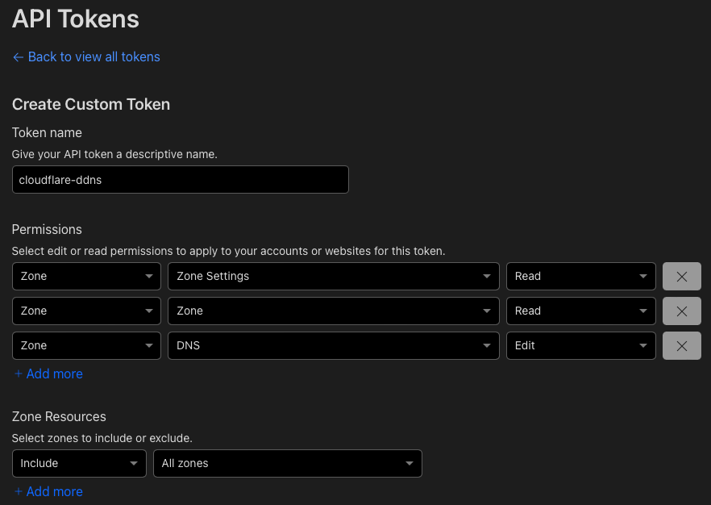

# Portainer + Docker Swarm managed cluster

This repo contains stacks for a secure and fully docker-managed cluster.

## Prerequisites

- A host machine with an initialized Docker Swarm.
- Port 443/TCP forwarded on the virtual IP for manager nodes (192.168.1.200 by default)
- Port 51820/UDP forwarded on the virtual IP for manager nodes (192.168.1.200 by default) - VPN Access
- A Cloudflare domain set up with:
  - A record on yourdomain.com
  - A record on www
  - CNAME on any subdomain
- A Cloudflare API token to support DDNS updates:
  -   

## Getting started 

- Deploy the `docker-compose.init.yml` on a manager node (see <https://docs.portainer.io/v/ce-2.11/start/install/server>)
  - If you own a business, you can get the business edition for free <https://www.portainer.io/pricing/take5>
- Deploy all stacks in the `stacks/` folder with Portainer to ensure:
  - DDNS updates to Cloudflare
  - Virtual IP that automatically allocates all managers to a single Virtual IP.

## Services in the cluster

### Traefik

### Portainer

Portainer is a centralized service delivery platform for containerized apps, that basically allows self-hosting docker applications in fully managed environments with either Docker Swarm or K8.

This service manages all other stacks in the cluster, and is capable of:

- Auto deploying stacks from GitHub, when they change.
- Running multiple environments for e.g. development web apps or production web apps.
- Manage all stuff Docker related

### WireGuard

Wireguard is a highly secure and performant VPN.

### PiHole

PiHole is a network-wide ad blocking service, that blocks an impressive amount of adds. The stack is set up to direct all traffic through PiHole from local clients, or clients connected through a VPN.

## Keepalived

Keepalived is used to set a virtual ip for each manager node, such that connecting to the virtual IP will ensure a manager is reached in case of system failure.

<https://hub.docker.com/r/lolhens/keepalived-swarm>
